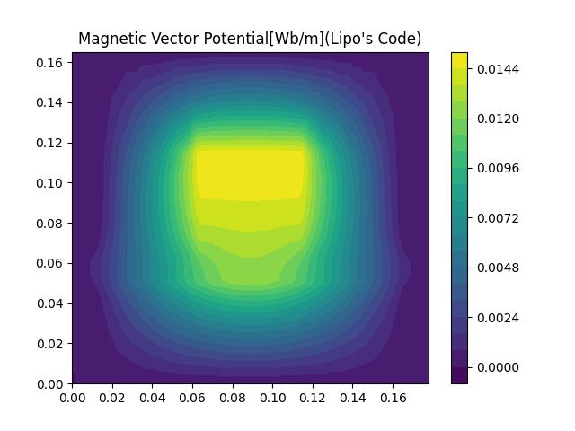

# Test Case: Simple Iron-cored Inductor with an Air Gap
Refer to [test_inductor.py](../src/test_inductor.py)

Starting from a simple iron-cored inductor with an air gap discussed in *[Introduction to AC machine design]((https://onlinelibrary.wiley.com/doi/book/10.1002/9781119352181))*, T. A. Lipo provides example code in the appendix. (Refer to [Lipo.m](./test_inductor/Lipo.m))

The example code provide a simple practice but have several shortcomings:
- Low-quality mesh: For the simplicity of counter plot(Flux density plot), which needs grid-like points, the triangles are not optimal.
- Low scalability: Modeling, meshing, solving, and post-processing are highly coupled in the example code, which limits the program's extensibility.
- Too much repetitive code ...

In my code, mesh, Gmsh is used to model.
Mesh, solver and post-processing components are decoupled.
User can import and analyze any Gmsh geometry with only few changes(mesh and current excitation).

## Results Comparison
To verify the accuracy of the results of my python code.
I export the coarse mesh in Lipo's code and use Gmsh to generate finer mesh.
Then I compared the FEA results of Lipo's code and my code with the same mesh(Lipo's code not support other mesh).
I also simulated the inductor using open source tool [FEMM(Finite Element Method Magnetics)](https://www.femm.info).
Since the meshing was different, I obtained the magnetic vector potential at the corresponding vertices of the Gmsh mesh.
The femm model and results are: [inductor.fem](./test_inductor/inductor.fem) and [inductor.ans](./test_inductor/inductor.ans).

<table>
    <tr>
      <th> Mesh in Lipo's book.</th>
      <th> Mesh in Gmsh</th>
      <th> Mesh in FEMM</th>
    </tr>
</table>

| | Lipo's Code | Lipo's Mesh + My code | Gmsh Mesh + My code | FEMM |
|--|--|--|--|--|
| Total Flux(Wb/m) | 0.0149 | 0.014908  | 0.014290 | 0.014396 |
| Total Energy(J) | 28.1353 | 28.1353  | 27.0102 | \ |
| Num. of Vertex | 1428 | 1428  | 6466 | 10751|

<table>
    <tr>
      <th> Results error between Lipo's code and my python code</th>
      <th> Results error between FEMM and my python code</th>
  </tr>
</table>

<table>
    <tr>
      <th> Magnetic vector potential plot of Lipo's code</th>
      <th> Magnetic vector potential plot of my python code(Lipo's mesh)</th>
    </tr>
    <tr>
      <th> Magnetic vector potential plot of FEMM</th>
      <th> Magnetic vector potential plot of my python code(Gmsh mesh)</th>
    </tr>
</table>

---

To conclude, my results match well with the that of the Lipo's book and FEMM.
Below are some other plots obtained from my python code:

<table>
    <tr>
      <th> Magnetic vector potential</th>
      <th> Magnetic vector potential</th>
    </tr>
    <tr>
      <th> FLux density</th>
      <th> FLux density</th>
    </tr>
    <tr>
      <th> Matrix T</th>
      <th> Energy</th>
    </tr>
</table>
