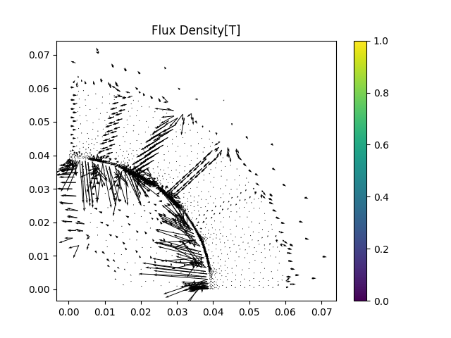
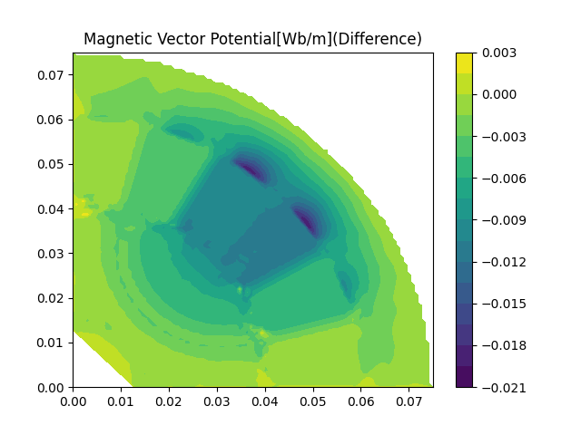

# Test Case: A Synchronous Reluctance Machine(SynRM)
Refer to [test_synrm.py](../src/test_synrm.py)

## SynRM Model

The SynRM model is shown above and its stack length is 0.0375m.

[Test case of inductor](./test_inductor.md) has proven the accuracy and extensibility of the program, the program can be applied to the model of SynRM with coarse and extra fine mesh([synrm_extrafine.nas](../data/coarse/synrm_coarse.nas),[synrm_extrafine.nas](../data/extraFine/synrm_extrafine.nas)), while only modifying mesh and current excitation.

<table>
    <tr>
      <th> Magnetic vector potential(Coarse)</th>
      <th> Magnetic vector potential(Fine)</th>
    </tr>
    <tr>
      <th> FLux density(Coarse)</th>
      <th> FLux density(Fine)</th>
    </tr>
    <tr>
      <th> FLux density(Coarse)</th>
      <th> FLux density(Fine)</th>
    </tr>
</table>

## Verify the results|

To verify the accuracy of the results,
I modeled the SynRM in [Hi-Motor Designe](https://designer.hi-motor.site) with circular flux-barrier SynRM parametric model, which is based on [FEMM](https://www.femm.info).

Actually, the model in FEMM differs slightly from the original model as I only have the mesh.
To achieve a perfect copy, spline curves can be utilized, but this process is time-consuming.
However, in this situation, there is no need to copy the model completely.
We just need to ensure that the model in my program matches the one in FEMM.
Therefore, I export the model as a DXF file and then convert it to a Gmsh model using the *[dxf2geo](../dxf2geo/README.md)* tool.

Since the meshing was different, I obtained the magnetic vector potential at the corresponding vertices of the Gmsh mesh.
The femm model and results are: [synrm_circular.fem](./test_synrm/synrm_circular.fem) and [synrm_circular.ans](./test_synrm/synrm_circular.ans).

### Different model and mesh

| | Coarse Mesh | Extra Fine Mesh | Gmsh | Femm |
|--|--|--|--|--|
| Num. of Vertex | 5589 | 86159 | 9569 | 8341

<table>
    <tr>
      <th> Given mesh(coarse)</th>
      <th> Given mesh(extra fine)</th>
    </tr>
    <tr>
      <th> Mesh in Gmsh</th>
      <th> Mesh in FEMM</th>
    </tr>
</table>

### Simulation results between different sources

<table>
  <tr>
  Currents in only two slots
  </tr>
  <tr>
    <th> Magnetic vector potential of my python code</th>
    <th> Magnetic vector potential of FEMM</th>
    <th> Results error between FEMM and my python code</th>
  </tr>
  <tr>
  Currents in all slots
  </tr>
  <tr>
    <th> Magnetic vector potential of my python code</th>
    <th> Magnetic vector potential of FEMM</th>
    <th> Results error between FEMM and my python code</th>
  </tr>
</table>

To conclude, my simulation results are consistent with the that of FEMM.
