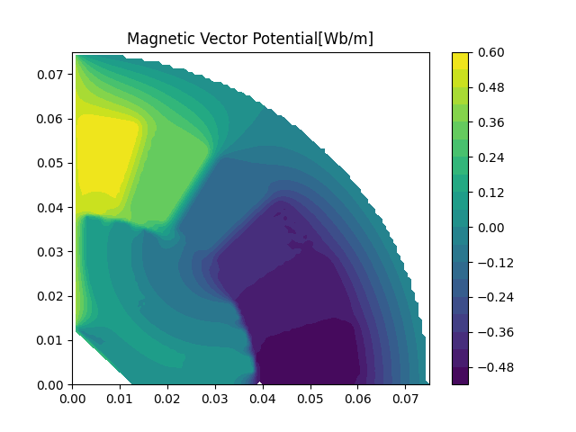
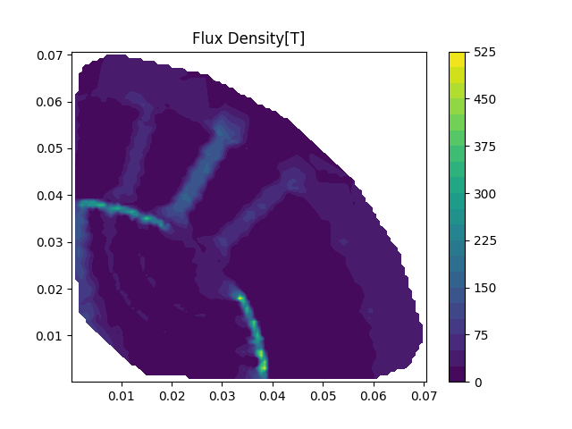

# Test Case: A Synchronous Reluctance Machine(SynRM)
Refer to [test_synrm.py](../src/test_synrm.py)

[Test case of inductor](./test_lipo.md) has proven the accuracy and extensibility of my code, my code can be applied to the model of SynRM with coarse and extra fine mesh, while only modifying mesh and current excitation.

For large-scale systems of linear equations, it may be difficult for classical methods like gaussian elimination and LU decomposition to solve.
Iteration methods like gauss-seidel method are developed to get an approximate solution.

As table is shown below, for extra fine mesh of SynRM in this case, the system of equations of is too large to solve with classical method, gauss-seidel method is used.

| | Coarse Mesh | Extra Fine Mesh |
|--|--|--|
| Total Flux(Wb/m) | 0.712218 | --  |
| Total Energy(W) | 1121.6359 | --  |
| Num. of Vertex | 5540 | 85912  |

To be honest, the FEA of extra fine mesh still can not converge very well(only tried with limited iterations).
We can improve this in two ways:
1. Try other advanced methods like successive over relaxation(SOR) iteration and conjugate gradient method.
2. Rewrite the solver component with high performance programming language(C++ or Rust).

Work is still ongoing.

<table>
    <tr>
      <th> Magnetic vector potential(Coarse)</th>
      <th> Magnetic vector potential(Fine)</th>
    </tr>
    <tr>
      <th> FLux density(Coarse)</th>
      <th> FLux density(Fine)</th>
    </tr>
    <tr>
      <th> FLux density(Coarse)</th>
      <th> FLux density(Fine)</th>
    </tr>
    <tr>
      <th> Energy(Coarse)</th>
      <th> Energy(Fine)</th>
    </tr>
    <tr>
      <th> Current density(Coarse)</th>
      <th> Current density(Fine)</th>
    </tr>
</table>
